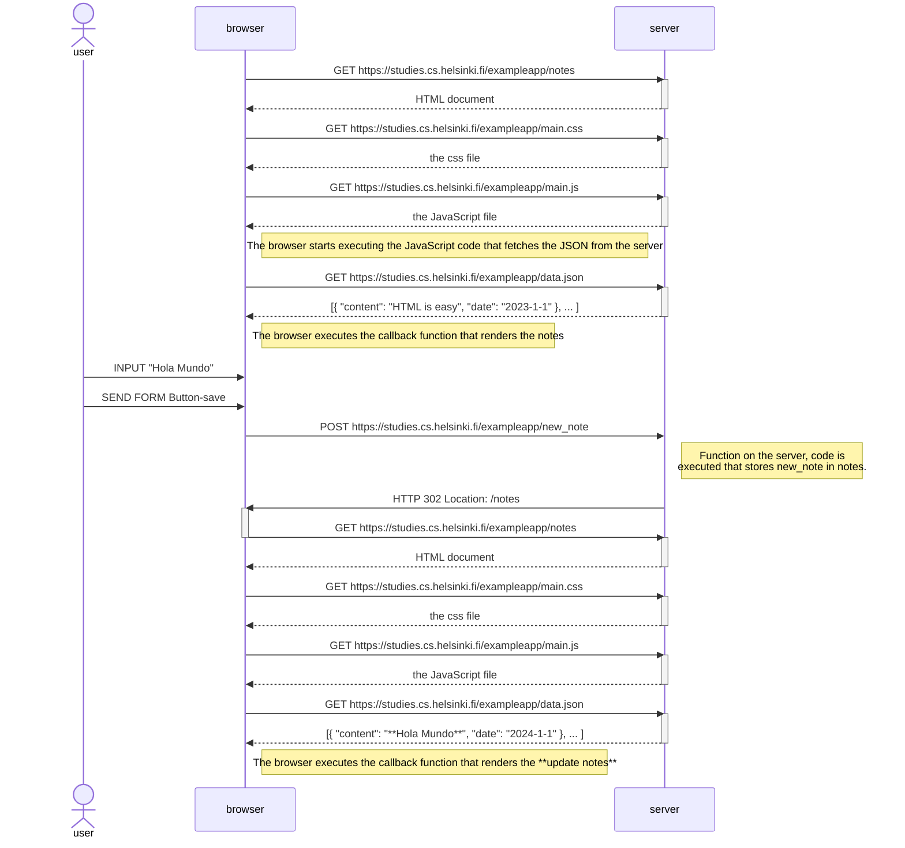

```mermaid
 sequenceDiagram

  actor  user
  participant browser
  participant server
  
  
  browser->>server: GET https://studies.cs.helsinki.fi/exampleapp/notes
  activate server
  server-->>browser: HTML document
  deactivate server
  
  browser->>server: GET https://studies.cs.helsinki.fi/exampleapp/main.css
  activate server
  server-->>browser: the css file
  deactivate server
  
  browser->>server: GET https://studies.cs.helsinki.fi/exampleapp/main.js
  activate server
  server-->>browser: the JavaScript file
  deactivate server
  
  Note right of browser: The browser starts executing the JavaScript code that fetches the JSON from the server
  
  browser->>server: GET https://studies.cs.helsinki.fi/exampleapp/data.json
  activate server
  server-->>browser: [{ "content": "HTML is easy", "date": "2023-1-1" }, ... ]
  deactivate server
  
  Note right of browser: The browser executes the callback function that renders the notes

  user->>browser: INPUT "Hola Mundo"
  user->>browser: SEND FORM Button-save
  browser ->> server: POST https://studies.cs.helsinki.fi/exampleapp/new_note

  Note right of server: Function on the server, code is <br/> executed that stores new_note in notes.

  server->>browser: HTTP 302 Location: /notes
  activate browser
  browser->>server: GET https://studies.cs.helsinki.fi/exampleapp/notes
  deactivate browser

 activate server
 server-->>browser: HTML document
  deactivate server
  
  browser->>server: GET https://studies.cs.helsinki.fi/exampleapp/main.css
  activate server
  server-->>browser: the css file
  deactivate server
  
  browser->>server: GET https://studies.cs.helsinki.fi/exampleapp/main.js
  activate server
  server-->>browser: the JavaScript file
  deactivate server

  browser->>server: GET https://studies.cs.helsinki.fi/exampleapp/data.json
  activate server
  server-->>browser: [{ "content": "**Hola Mundo**", "date": "2024-1-1" }, ... ]
  deactivate server
  
  Note right of browser: The browser executes the callback function that renders the **update notes** 
```
