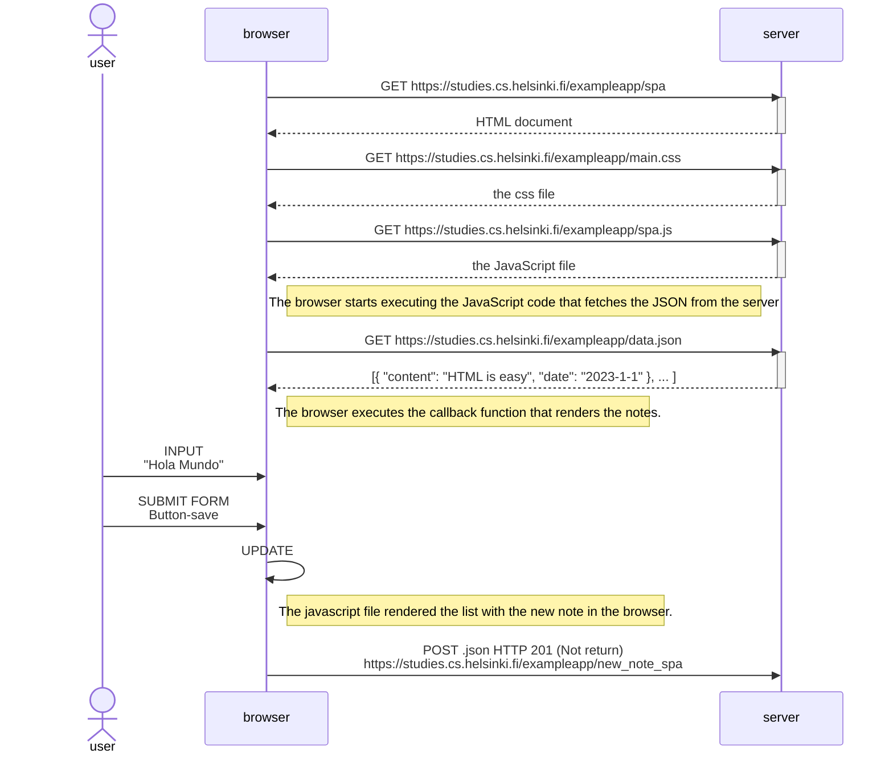

**0.5: Diagrama de aplicaciones de una sola página**
 

```mermaid

 sequenceDiagram

  actor  user
  participant browser
  participant server
  
  
  browser->>server: GET https://studies.cs.helsinki.fi/exampleapp/spa
  activate server
  server-->>browser: HTML document
  deactivate server
  
  browser->>server: GET https://studies.cs.helsinki.fi/exampleapp/main.css
  activate server
  server-->>browser: the css file
  deactivate server
  
  browser->>server: GET https://studies.cs.helsinki.fi/exampleapp/spa.js
  activate server
  server-->>browser: the JavaScript file
  deactivate server
  
  Note right of browser: The browser starts executing the JavaScript code that fetches the JSON from the server
  
  browser->>server: GET https://studies.cs.helsinki.fi/exampleapp/data.json
  activate server
  server-->>browser: [{ "content": "HTML is easy", "date": "2023-1-1" }, ... ]
  deactivate server

  Note right of browser: The browser executes the callback function that renders the notes.

  user->>browser: INPUT <br/>"Hola Mundo"
  user->>browser: SUBMIT FORM <br/> Button-save
  browser ->> browser: UPDATE
  Note right of browser: The javascript file rendered the list with the new note in the browser.

  browser->>server: POST .json HTTP 201 (Not return) <br/> https://studies.cs.helsinki.fi/exampleapp/new_note_spa
  
```
